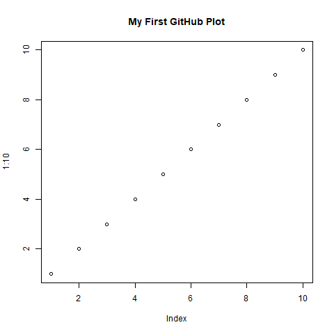

# Machine Learning Taste

This repository contains my first machine learning practice in R.

## Content
- Logistic regression model (temperature vs plant status)

## Purpose
To build a foundation in machine learning for research applications in biochar, hyperspectral imaging (HSI), and plant systems.

## Author
Ruogu Tang

## Output Example

A simple plot generated from the R script:

